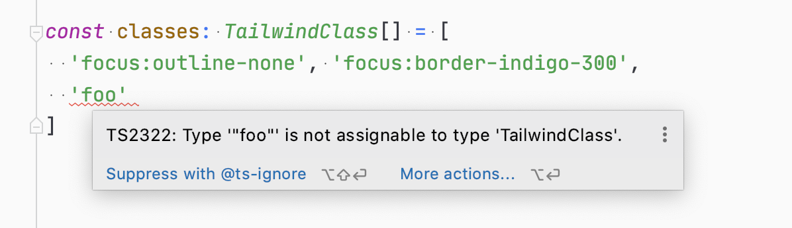
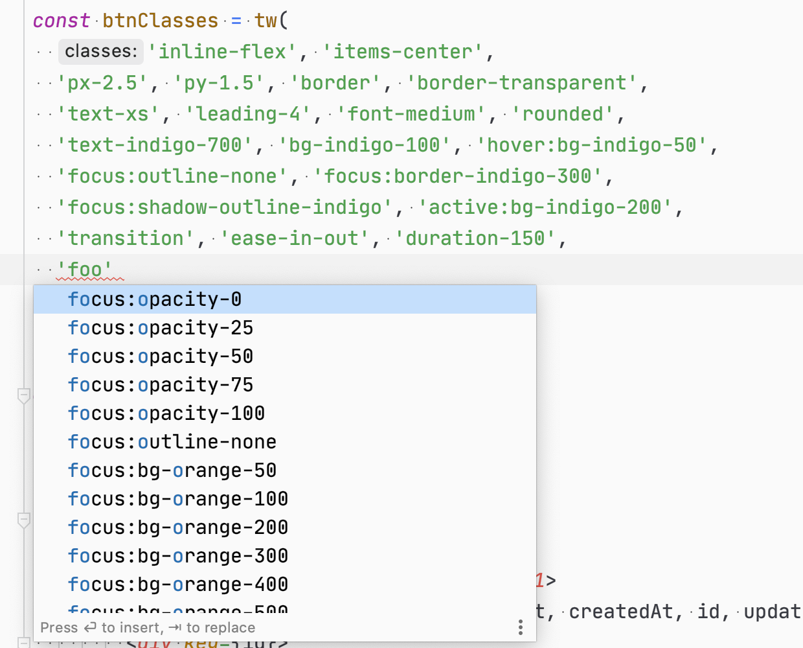

# Tailwind TS Generator

[](https://www.npmjs.com/package/tailwind-ts)
[](https://www.npmjs.com/package/tailwind-ts) 


**⚡️ Generate Tailwind type from your own configuration!**

This package is a [Tailwindcss](https://tailwindcss.com) plugin that generates code out of your tailwind configuration.
It has full support of your personalised config, and your plugins.

For example, it is used daily with `@tailwind/ui` and `@tailwindcss/custom-forms`.
It doesn't change anything to your other postcss plugins like `autoprefixer` and `purgecss`. 

<br>





<br>

## Installation
Add it to your dependencies

```bash
yarn add -D tailwind-ts

# or
npm install --save-dev tailwind-ts
```

Add it at the end of the [plugins list](https://tailwindcss.com/docs/configuration/#plugins) in your `tailwind.config.js` file.
```js
module.exports = {
  ...
  plugins: [
    ...
    require('tailwind-ts'),
  ],
};
``` 

And _voilà_!

Now a `tailwind-types.ts` file will be generated each time you generate your css with tailwind.
 
## Configuration

You can select what you want to include in the generated file by passing options to the plugin:

```js
module.exports = {
  ...
  plugins: [
    ...
    require('tailwind-ts')({ path: 'my-custom-file.ts' }),
  ],
};
```

| Option                 | Type    | Default value        | Usage                                                                 |
|----------------------- |---------|----------------------|---------------------------------------------------------------------- |
| path                   | string  | `'tailwind-type.ts'` | Path of the generated file (relative to your configuration file)      |
| exportClassesChoice    | boolean | `true`               | To generate the `TailwindClass` type (see [usage](#tailwindclass))            |
| exportClassesList      | boolean | `false`              | To generate the `TailwindClasses` type (see [usage](#tailwindclasses))          |
| exportClassNamesHelper | boolean | `false`              | To generate the `tw` helper (see [usage](#tw))                     |
| exportConstants        | boolean | `false`              | To generate all the tailwind inspired constants (see [usage](#tailwind-constants)) |


## Usage

### TailwindClass
With `exportClassesChoice` set, the package will generate and export an 
[union type](https://www.tutorialsteacher.com/typescript/typescript-union) `TailwindClass` with all Tailwind available utilities :

```ts 
export type TailwindClass = 'sr-only' | 'not-sr-only' | 'focus:sr-only' | ...
``` 

You can use it directly by importing the type from the generated file.

For example:
```tsx
import { TailwindClass } from './tailwind-types'
const globalPaddingClass: TailwindClass = 'px-2.5'

const btnClasses: TailwindClass[] = [
  'inline-flex', 'items-center',
  globalPaddingClass, 'py-1.5', 'border', 'border-transparent',
  'text-xs', 'leading-4', 'font-medium', 'rounded',
  'text-indigo-700', 'bg-indigo-100',
  'hover:bg-indigo-50', 
  ...
]

return <button className={btnClasses.join(' ')}>Foo !</button>
```


### tailwindClasses
With `exportClassesList` set, the package will generate and export an array `tailwindClasses` 
which lists all Tailwind available utilities:

```ts 
export const tailwindClasses = [
  'sr-only',
  'not-sr-only',
  'focus:sr-only', 
  ...
] as const
``` 

You can use it directly by importing the const from the generated file.

For example:
```ts
import { tailwindClasses } from './tailwind-types'

const xlClasses = tailwindClasses
  .filter(className => className.includes('xl'))
  .map(className => className.replace('xl:', ''))
  ... 

```

### tw
With `exportClassNamesHelper` set, the package will generate and export a function `tw` 
which is just a typed wrapper of [classnames](https://github.com/JedWatson/classnames) package:

```ts 
type TailwindClassNamesFunction = ...

export const tw: TailwindClassNamesFunction = require('classnames')
```

You can use it directly by importing the function from the generated file.

For example:
```tsx
import { tw } from './tailwind-types'

const shouldBeRed = true / false //useState, computed or whatever... your logic here!
const shouldBeBordered = true / false //useState, computed or whatever... your logic here!

const btnClasses = tw(
  'inline-flex', 'items-center',
  'px-0.5', 'py-1.5',
  'text-xs', 'leading-4', 'font-medium', 'rounded',
  'hover:bg-indigo-50', 
  shouldBeRed ? ['text-red-700', 'bg-red-100'] : ['text-indigo-700', 'bg-indigo-100'],
  { 'border': shouldBeBordered },
)

return <button className={btnClasses}>Foo !</button>
```

This is exactly the same syntax and features than [classNames](https://github.com/JedWatson/classnames) function here, 
but fully Tailwind typed.

### Tailwind Constants
This one is a bit more special. 
With `exportConstants` set, the package will generate and export all the tailwind utilities as constants.

```ts 
export const twBgGray50 = 'bg-gray-50' as const
export const twBgGray100 = 'bg-gray-100' as const
export const twHoverFontBold = 'hover:font-bold' as const
export const twH64 = 'h-64' as const
...
```
You can use it directly by importing the constants from the generated file.

For example:
```tsx
import { twText3Xl } from './tailwind-types'

return <h1 className={twText3Xl}>Foo !</h1>

```

You have to note that because constants in javascript follow a specific syntax, and some words are forbidden, some rules have to be applied:
  - constants are camelCased,
  - a `tw` prefix is added. (mainly because of `static` utility which is not allowed as const name and so becomes `twStatic`),
  - all the `:` and `-` characters are removed,
  - the `.` is replace by `Dot`: `w-3.5` becomes `twW3Dot5`
  - the `/` is replace by `On`: `w-3/5` becomes `twW3On5`
  

### Other?

By the way the plugin is made, it is really easy to add generated content from the list of classes. 
New generators could be added the core, or be the subject of plugins if there are some needs.

Example of generators: ReasonMl or flow typings, pure javascript constants, etc. 

**Please feel free to open an issue, so we can discuss that.**

## FAQ

### Will tailwind-ts be in my browser bundle?
It's a big nope!
The package is a nodejs tool, and is meant to be used only during development phase.

The generated file however can be included in your bundle depending on what you do with it, 
so be attentive to your building process, and the size of your bundle. 

### What are the dependencies of this package.

The only needed dependency of this package is [ramda](https://ramdajs.com), a tool for data manipulation with 
functional programming flavor. Please check out of [the code](./src) of this package to understand why and how it is amazing.

The package has also tailwindcss as a peerDependency, but it should not be a problem as it's actually a tool for Tailwind.

You also will need [camelCase](https://github.com/sindresorhus/camelcase) if you want to export the constants, 
and [classnames](https://github.com/JedWatson/classnames) if you want to export the classNames wrapper.

At the end, as said previously, this package will not be included in your bundle. 
You even can remove it after having generated the type if you want. 

### Another question?

Please feel free to [ask](https://github.com/mathieutu/tailwind-ts/issues/new)!


## License

This package is an open-sourced software licensed under the [MIT license](http://opensource.org/licenses/MIT).


## Contributing

Issues and PRs are obviously welcomed and encouraged, both for bugs and new features as well as documentation.
